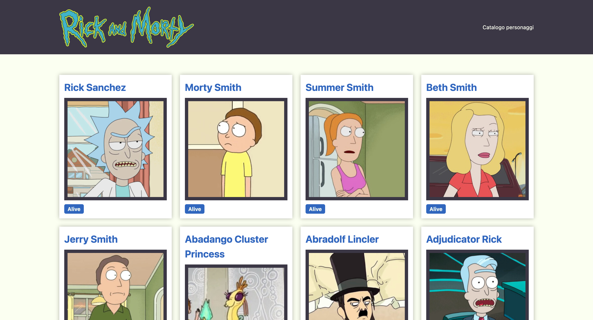

# Rick and Morty Character Status App  
*A simple web app to check character statuses from the Rick and Morty universe.*  



## 🔧 Technologies Used  
- **HTML5**  
- **CSS3**  
- **JavaScript** (Vanilla)  
- [Rick and Morty API](https://rickandmortyapi.com/)  

## 🌟 Features  
- Fetches and displays all characters from the API  
- Shows character status (**Alive**, **Dead**, or **Unknown**)  
- Clean, responsive interface  

## 🚀 Getting Started  
1. Clone this repository:  
   ```bash
   git clone https://github.com/davidecondoluci/ricknmorty-api-character-status.git
   ```
2. Open `index.html` in your browser.  

## 📜 Project Background  
Built during a workshop at [Mohole School](https://www.mohole.it/) with guidance from a teacher. This was one of my first experiences working with APIs in JavaScript.  

## 📂 Repository Structure  
```
/ricknmorty-api-character-status
├── index.html          # Main HTML file
├── style.css           # CSS styles
└── script.js           # JavaScript logic
```

## 🔗 Links  
- [Rick and Morty API Documentation](https://rickandmortyapi.com/documentation)  
